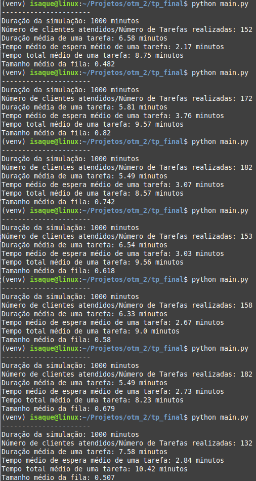

# Simulação de Filas Markovianas

## Instruções para execução
No diretório do trabalho.

```bash
python3 -m venv venv
pip install -r requirements.txt
python main.py
```

## Resultados


Simulação de 7 execuções com os valores de `MI` igual a 2 e `LAMBDA` igual a 1.

## Vídeo de apresentação
